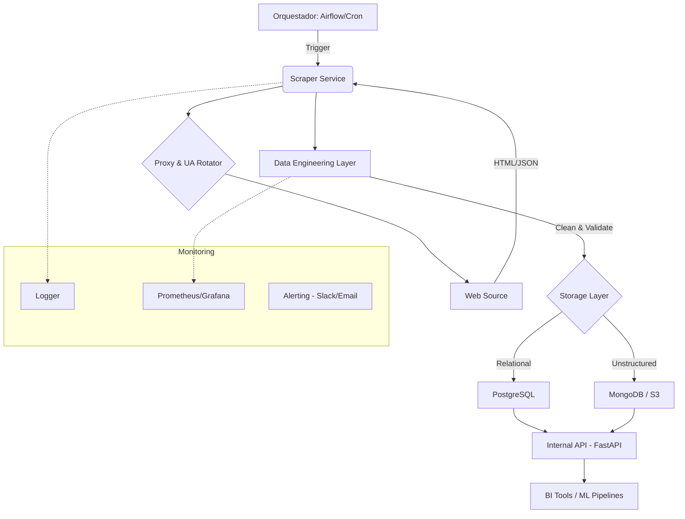

# 🏗️ Enterprise Web Scraping Pipeline

Este proyecto implementa una arquitectura de web scraping a nivel empresarial, diseñada para ser modular, escalable, legal y ética. Supera los scripts básicos mediante la separación de responsabilidades y el uso de tecnologías estándar de la industria.

## 🚀 Arquitectura del Sistema

El sistema se divide en capas independientes para facilitar el mantenimiento y la escalabilidad.

### 📊 Diagrama de Flujo (Mermaid)



## 🛠️ Componentes Clave

1.  **Core Scraper Subsystem**:
    *   Manejo de sesiones y cookies.
    *   Rotación balanceada de Proxies y User-Agents para evitar bloqueos.
    *   **Legalidad**: Verificación automática de `robots.txt` y cumplimiento de los Términos de Servicio.
2.  **Pipeline de Procesamiento (ETL)**:
    *   Limpieza semántica de datos (encoding, normalización).
    *   Validación de calidad con esquemas (Pydantic).
    *   Anonimización de datos sensibles (cumplimiento GDPR).
3.  **Capa de Almacenamiento**:
    *   **PostgreSQL**: Para datos transaccionales y estructurados.
    *   **MinIO/S3**: Para respaldos de las páginas HTML originales (Data Lake).
4.  **Monitoreo y Alertas**:
    *   Logs rotativos para auditoría.
    *   Alertas en tiempo real si falla un scraping crítico.

## 📁 Estructura del Proyecto

```text
/
├── api/                  # API interna para consulta de datos (FastAPI)
├── core/                 # Lógica compartida (BaseScraper, DB Manager)
├── services/             # Implementaciones específicas de scrapers
├── infrastructure/       # Configuración de Docker y Kubernetes
├── dags/                 # Definiciones de flujos de trabajo (Airflow)
├── data/                 # Almacenamiento local (volúmenes)
└── tests/                # Pruebas unitarias y de integración
```

## ⚖️ Ética y Cumplimiento

*   **Respeto a robots.txt**: Siempre comprobamos las directivas de rastreo.
*   **Rate Limiting**: El sistema implementa esperas aleatorias y exponenciales para no sobrecargar los servidores destino.
*   **Datos Públicos**: Solo recolectamos información que es de acceso público.

## 🏁 Cómo empezar

1.  **Requisitos**: Docker y Python 3.10+.
2.  **Instalación**:
    ```bash
    pip install -r requirements.txt
    ```
3.  **Ejecutar Scraper**:
    ```bash
    python services/quotes_scraper.py
    ```
4.  **Lanzar API**:
    ```bash
    uvicorn api.main:app --reload
    ```

---
*Este proyecto es parte de mi portafolio para demostrar diseño de sistemas distribuidos y procesamiento de datos a gran escala.*